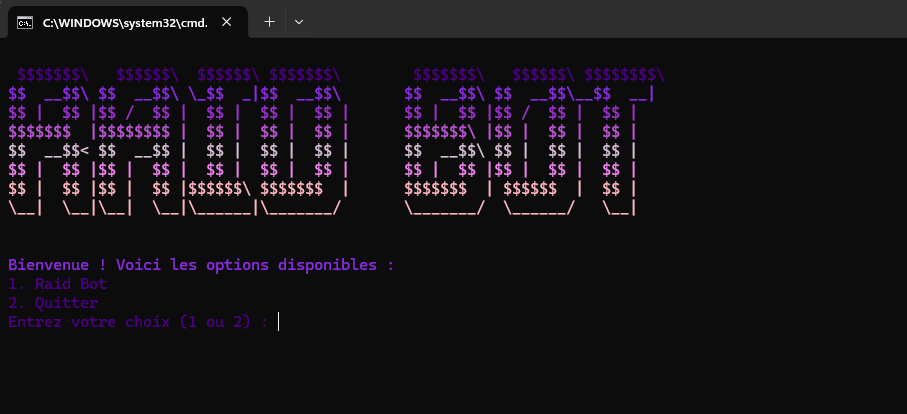
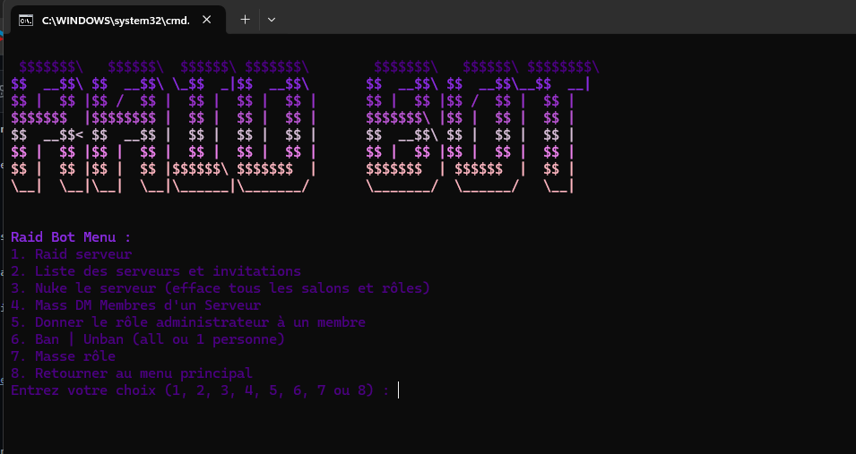

# RaidBot Discord Tools

Ce bot Discord est conçu pour effectuer plusieurs actions Raid de serveur , Nuke de serveur ou Avoir la list des serveur ou et le bots.

## Update

Mass dm ajoutées. ✅

Donner un role administrateur a un membres. ✅ 

Erreur rate limited, requirements intents bots & permissions requis pour le bot ajoutées ✅  Date : 10/07/24

Ban all/Unban all ou Ban 1 personne ou Unban 1 personne ✅  Date : none

Mass rôle add ✅  Date : 27/08/24

## Screenshot





## Installation

pip install -r requirements.txt

1. **Installation Requirements**
   ```bash
   pip install -r requirements.txt

2. **Clonage du projet**
   ```bash
   git clone https://github.com/kzoxmazpx/RaidBot.git
   cd RaidBot
